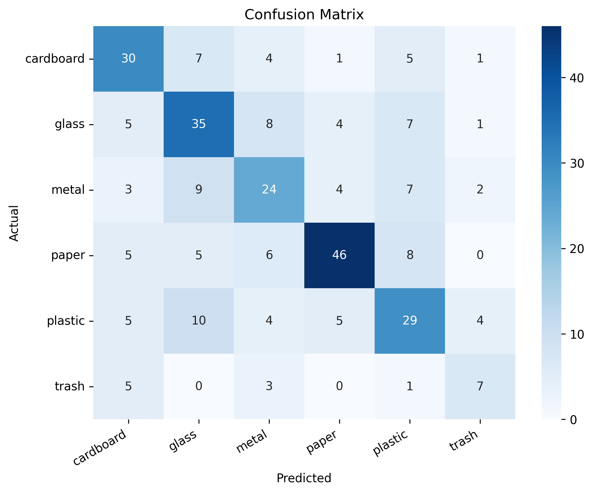
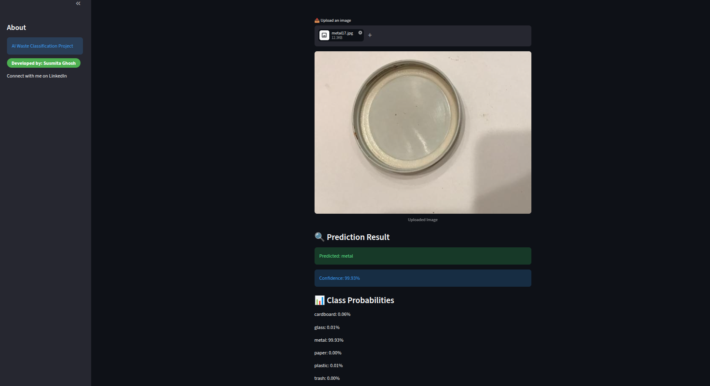

# ♻️ Waste Classification using Machine Learning & OpenCV


## 📌 Project Overview

This is a computer vision system that classifies waste images into categories such as plastic, paper, glass, metal, and organic waste. It uses OpenCV for image preprocessing and a Convolutional Neural Network (CNN) for classification.

The project focuses specifically on the AI component of waste classification, and shows how that component could be integrated into a larger smart waste management system.

**Objective:** Design and deploy an accurate, scalable waste classification system using deep learning for real-world environmental applications.

## Real World Applications

### ♻️ Smart Waste Segregation Assistance
The model can plug into apps that help individuals and organizations correctly classify waste items from a photo. This cuts down on human error in manual segregation and encourages better recycling habits.

### 🏫 Educational and Awareness Tools
Schools, universities, and public campaigns can use the system to teach proper waste disposal, giving users instant feedback on what category an item falls into.

### 📱 Mobile and Web Based Solutions
Since it's deployed with Streamlit, the model is accessible through a web interface, letting users upload images and get real-time results from a browser.

### 🤖 Integration with Automated Systems (Future Scope)
The trained model could serve as the core intelligence behind automated waste management systems. Paired with cameras and hardware like an Arduino Uno or a Raspberry Pi 4, it could enable real-time sorting in smart bins or recycling facilities.

### 🌱 Environmental Impact
Better waste segregation accuracy means more efficient recycling, less landfill waste, and stronger support for sustainability efforts overall.

---

## 🚀 Features

- Image classification into multiple waste categories
- OpenCV based image preprocessing
- CNN based deep learning model
- Real time prediction on uploaded images
- Streamlit web app for a live demo

---

## 🧠 Tech Stack

- Python
- OpenCV
- TensorFlow / Keras
- NumPy, Matplotlib
- Streamlit (for the UI)

---

## 📂 Dataset

Dataset used: TrashNet / Kaggle Garbage Classification

Classes:
- Cardboard
- Glass
- Metal
- Paper
- Plastic
- Trash

---

## ⚙️ Project Workflow

1. Data collection
2. Data preprocessing (OpenCV)
3. Exploratory data analysis (EDA)
4. Model building (CNN)
5. Model training
6. Evaluation (accuracy, confusion matrix)
7. Deployment (Streamlit app)

---

## 🧪 Model Performance

**⚠️ Note:** > **Note:** Due to hardware memory limitations, the model was initially trained on a subset of 1200 samples. Increasing the dataset size to approximately 5000 samples is expected to further improve performance.**

- Accuracy: 0.5700
- Loss: 2.5887
- Precision: 0.5771
- Recall: 0.5700
- F1-score: 0.5720
<p align="center">
  
</p>

---

## 📸 Demo

🌐 **Live Demo:** [ai-waste-classifier-ed8ia2k9rcpppd4mgjx45y.streamlit.app](https://ai-waste-classifier-ed8ia2k9rcpppd4mgjx45y.streamlit.app/)

Example flow:
1. Upload an image
2. Model runs a prediction
3. App displays the predicted waste category



---

## 🖥️ How to Run This Project

### 1. Clone the repository
```bash
git clone https://github.com/susmitag6/AI-Waste-Classifier.git
cd AI-Waste-Classifier
```

### 2. Install dependencies
```bash
pip install -r requirements.txt
```

### 3. Run the Streamlit app
```bash
streamlit run app/streamlit_app.py
```
